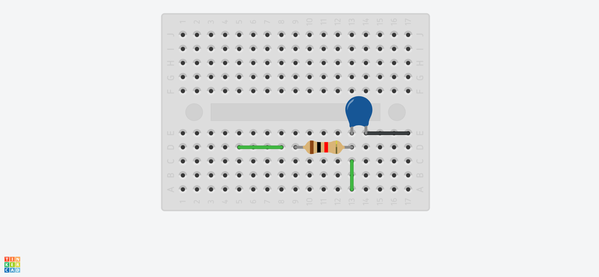
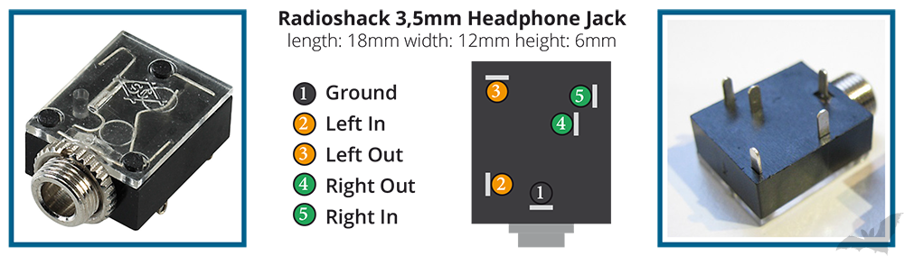
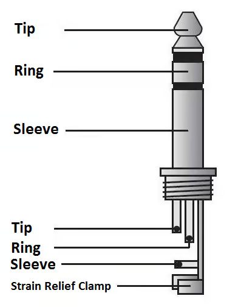

# Project 29: OLED Internet Radio

This project turns the **Shrike Fi (ESP32-S3)** into a fully functioning standalone internet radio! It uses an OLED display to show the current station, two buttons to browse through 5 pre-programmed radio stations, and outputs audio directly to a TDA2030 amplifier using high-frequency PDM.

## 1. Hardware & Wiring

### Audio Output (RC Filter)
- Connect a **Resistor (1kΩ - 4.7kΩ)** in series from `ESP_IO18` to the `IN` pin of the TDA2030.
- Connect a **Capacitor (10nF - 100nF)** bridging the `IN` pin of the TDA2030 directly to `GND`.
- **Power:** Power the TDA2030 with a 12V battery. **CRITICAL:** Connect the TDA2030's `GND` to any `GND` on the Shrike Fi.

### 3.5mm Audio Connector (Mono Wiring)
Since the ESP32 outputs a single mono audio channel, you need to wire the 3.5mm headphone jack accordingly. Refer to the pinout diagrams below:

**Wiring for mono output:**
- **Pin 1 (Sleeve/Ground)** → Connect to `GND`
- **Short Pins 2 and 3 together** (Left In + Right In) — this sends the mono signal to both the Tip and Ring so you get audio in both ears/speakers.
- Connect the shorted pair to the audio output from the TDA2030.

### OLED Display (SPI)
- **VCC:** 3.3V
- **GND:** GND
- **SDA/MOSI/D1:** ESP_IO1
- **SCL/CLK/D0:** ESP_IO2
- **DC (Data/Command):** ESP_IO3
- **CS (Chip Select):** ESP_IO4
- **RES (Reset):** ESP_IO5

### Control Buttons
We use two buttons to cycle through the radio stations. Because we use `INPUT_PULLUP` in the code, you only need to connect the buttons between the GPIO pin and Ground. No external resistors required!
- **Next Station Button:** Connect one side to `ESP_IO4`, and the other side to `GND`.
- **Previous Station Button:** Connect one side to `ESP_IO5`, and the other side to `GND`.

## 2. Software Setup (Arduino IDE)

### Install Required Libraries
You need the audio libraries (installed via ZIP from GitHub):
1. [arduino-audio-tools](https://github.com/pschatzmann/arduino-audio-tools)
2. [arduino-libhelix](https://github.com/pschatzmann/arduino-libhelix)

You also need the display libraries (installed via the Arduino Library Manager):
3. **Adafruit GFX Library**
4. **Adafruit SSD1306**
