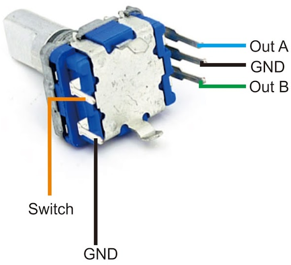

# Project 38: Rotary Encoder Menu System

A scrollable OLED UI menu driven by a rotary encoder knob. Turn to navigate, click to select. Written in **MicroPython**, works on both Shrike Lite and Shrike Fi.

## Features
- Scrollable 3-row menu with a live `>` cursor arrow
- Scroll indicator bar on the right edge of the display
- Press-to-select runs a per-item demo action, then returns to the menu
- Proper encoder edge-detection — no polling jitter
- 50ms button debounce built in

## Hardware Required
| Component | Qty |
|-----------|-----|
| Shrike Lite or Shrike Fi | 1 |
| SSD1306 OLED (128×64, **SPI**) | 1 |
| KY-040 Rotary Encoder Module **OR** Raw EC11 Rotary Encoder | 1 |

## Wiring / Pinout

### Shrike Lite (RP2040)
| Signal | Pin |
|--------|-----|
| OLED SCL (CLK) | `RP_IO10` |
| OLED SDA (MOSI) | `RP_IO11` |
| OLED CS | `RP_IO14` |
| OLED DC | `RP_IO15` |
| OLED RES | `RP_IO9` |
| Encoder CLK | `RP_IO16` |
| Encoder DT | `RP_IO17` |
| Encoder SW (push) | `RP_IO26` |

### Shrike Fi (ESP32-S3)
| Signal | Pin |
|--------|-----|
| OLED SCL (CLK) | `ESP_IO5` |
| OLED SDA (MOSI) | `ESP_IO6` |
| OLED CS | `ESP_IO7` |
| OLED DC | `ESP_IO4` |
| OLED RES | `ESP_IO3` |
| Encoder CLK | `ESP_IO15` |
| Encoder DT | `ESP_IO16` |
| Encoder SW (push) | `ESP_IO17` |

OLED VCC → 3.3V, GND → GND.

**Encoder Power & Wiring:**



- **If using a KY-040 Module:** Connect `VCC` to `3.3V` and `GND` to `GND`. The `CLK`, `DT`, and `SW` pins go to their respective data pins in the tables above.
- **If using a Raw Encoder (e.g. bare EC11, as shown in the image above):** 
  There is no VCC pin! Based on the image provided:
  - **Out A (Blue line):** Wire this to the `Encoder CLK` pin in the table above.
  - **Out B (Green line):** Wire this to the `Encoder DT` pin in the table above.
  - **Switch (Orange line):** Wire this to the `Encoder SW` pin in the table above.
  - **GND (Black lines):** Wire BOTH the middle pin on the 3-pin side AND the remaining pin on the 2-pin side directly to `GND`. The code already enables internal pull-up resistors for you!
## Software Setup (MicroPython)

1. Flash your board with MicroPython firmware.
2. Navigate into the `shrike_lite` or `shrike_fi` folder.
3. Upload both `ssd1306.py` and `main.py` to the board:
   ```bash
   mpremote cp ssd1306.py :ssd1306.py
   mpremote cp main.py :main.py
   ```
4. Reboot to run:
   ```bash
   mpremote soft-reset
   ```

## How to Use
- **Turn knob left/right** to move the `>` cursor up and down.
- **Press the knob** to select the highlighted item.
- Each item runs a short demo and returns to the menu after 2 seconds.

## Menu Items
| Item | What it does |
|------|-------------|
| LED Blink | Blinks the onboard LED (Pin 25) on Shrike Lite, or an external LED on `ESP_IO21` on Shrike Fi. |
| Show Info | Displays the board name and firmware on OLED |
| Counter | Counts down from 5 to 0 on the OLED |
| About | Shows project info |
