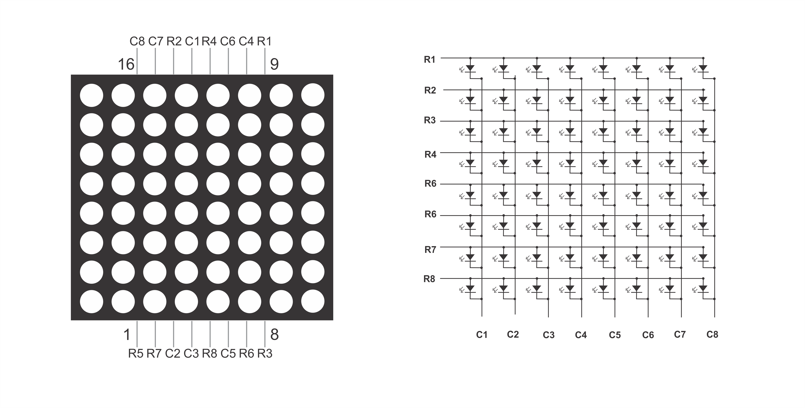

# Project 49: Beating Heart on 8x8 LED Matrix



Display a beating heart animation on a raw 8x8 LED matrix display without using any external driver ICs like the MAX7219! This project uses a custom GPIO-based multiplexing driver to scan the rows and columns so fast that it creates a stable image. Written in **MicroPython**.

Supports both **Shrike Lite** and **Shrike Fi**.

## Hardware Required
| Component | Qty |
|-----------|-----|
| Shrike Lite or Shrike Fi | 1 |
| 8x8 LED Matrix (Raw, e.g. 1088AS or 1088BS) | 1 |
| 220Ω Resistors | 8 |

## Wiring / Pinout

*Note: The exact pinout of bare 8x8 matrices varies wildly. The pin mapping below assumes a common 1088AS (Common Cathode) pinout. You will need to identify your matrix's row and column pins using a multimeter or datasheet.*

**Always place a 220Ω resistor on every ROW pin to prevent burning out the LEDs or your microcontroller!**

### Shrike Lite (RP2040)
| Matrix | Pin |
|--------|-----|
| Rows 1-8 | `RP_IO16` through `RP_IO23` |
| Cols 1-8 | `RP_IO24` to `RP_IO29`, plus `RP_IO5`, `RP_IO6` |

### Shrike Fi (ESP32-S3)
| Matrix | Pin |
|--------|-----|
| Rows 1-8 | `ESP_IO16`, `17`, `18`, `19`, `20`, `21`, `41`, `42` |
| Cols 1-8 | `ESP_IO2`, `1`, `3`, `46`, `4`, `5`, `6`, `7` |

*If your matrix looks inverted or weird, try changing `common_anode=False` to `common_anode=True` in `main.py`!*

## Software Setup (MicroPython)

This project requires 4 files on the board:
- `matrix.py` (The driver) - *From the custom driver repo*
- `font5x7.py` (Font library) - *From the custom driver repo*
- `icons.py` (Pre-built bitmap icons) - *From the custom driver repo*
- `main.py` (The animation loop) - *Located in your board's folder*

To avoid duplicating the driver code in this repository, you should clone the original matrix driver directly from GitHub.

1. Flash your board with MicroPython firmware.
2. Clone the driver repository to your computer:
   ```bash
   git clone https://github.com/drik245/matrix_display_driver.git
   ```
3. Navigate into your board's folder (e.g., `49_beating_heart/shrike_fi` or `49_beating_heart/shrike_lite`).
4. Upload all four files (the three drivers from the cloned repo and your local `main.py`) in one single concatenated command. Replace `../matrix_display_driver/` with the actual path to where you cloned the repo:
   ```bash
   mpremote cp ../matrix_display_driver/matrix.py :matrix.py cp ../matrix_display_driver/font5x7.py :font5x7.py cp ../matrix_display_driver/icons.py :icons.py cp main.py :main.py soft-reset
   ```
*(The above command automatically soft-resets your board at the end so the animation starts immediately!)*

## How It Works
The `Matrix8x8` class uses a hardware Timer to interrupt the processor 6,400 times per second (for a 50Hz frame rate). During each interrupt, it turns off the previous row, sets the columns for the next row based on the current framebuffer, and turns the new row on. By alternating between a large heart icon and a custom small heart bytearray every 300ms, a beating effect is created.
